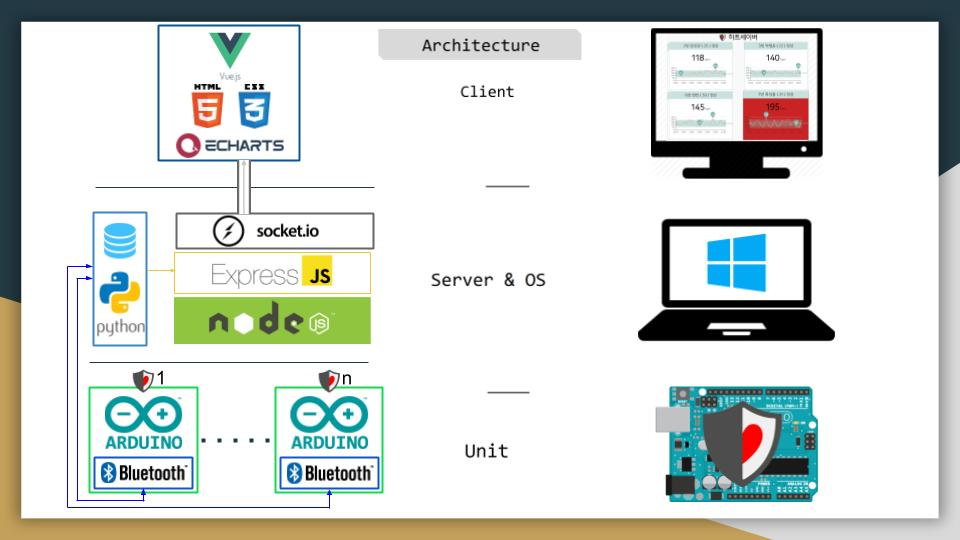
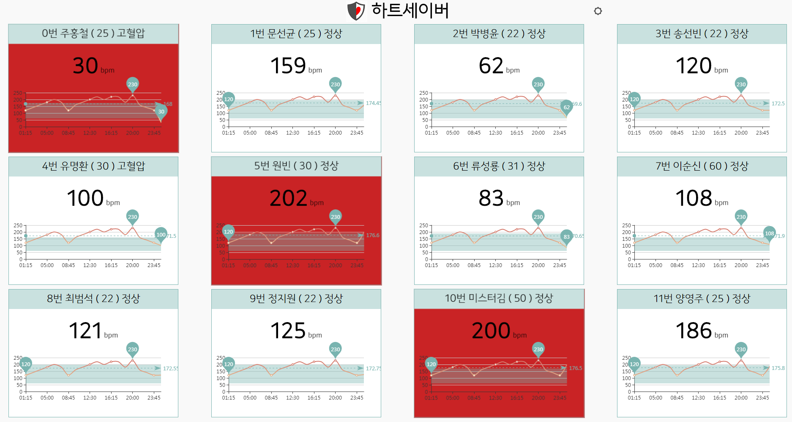
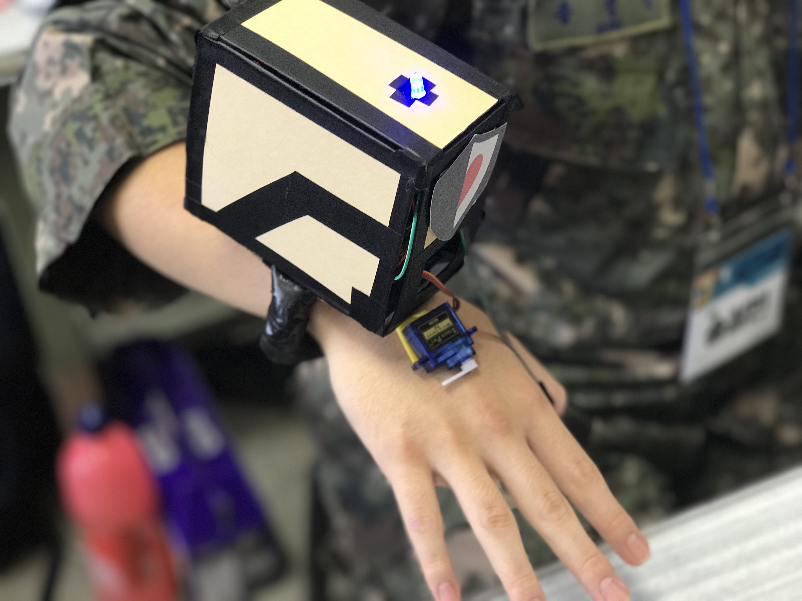

# HEARTSAVER

> VUE.JS + NODE.JS + PYTHON + ARDUINO project

> Arduino : RFID, LED, BLUETOOTH, TEMPERATUREHUMIDITY SENSOR, VIBRATION

##팀, 하트세이버(공군 중위 주홍철, 육군 중위 문선균, 공군 병장 송성빈, 박병윤)의 IOT Project 
체력검정, 오래달리기를 하다 죽기도 합니다. 이를 방지하기 위한, 
<br>
안전한 체력검정을 위한 실시간 모니터링 및 웨어러블 IOT자각인지센서팔지, 하트세이버!!
<br>
개개인의 심박수 임계치를 설정하여 그 임계치를 기반으로 심박수를 모니터하고 자각인지를 하게 합니다!
<br> 
(심박수 센서가 없어 온도센서로 모의구현하였습니다.)
``` bash 
1. 처음에 패스를 아두이노에 대면 RFID를 통해 군번을 읽어옵니다. 
2. 군번에 해당하는 나이, 이름, 병력값을 파이썬으로 짠 통신모듈을 통해 SQLLITE DB에서 긁어 옵니다. 
3. 이를 바탕으로 임계점을 설정합니다. (최대 : 220 - 나이 - 질병인덱스, 최소 : 60)
4. 심박도센서값이 파이썬 통신모듈로 전해지게 되고, 이를 바탕으로 파이썬 통신 모듈에서 위험한지 안한지를 판단합니다. 
5. 판단한 후, 위험하다면 아두이노로 보내어 LED센서와 진동센서를 작동시킵니다. 
6. 또한, 파이썬 통신모듈을 통해 NODE.JS 서버로 이름, 나이, 센서 등의 값을 보냅니다. 
7. 이를 바탕으로 Client와 소켓연결, 데이타를 클라이언트로 전송하여 실시간 모니터링을 구현합니다.
```

## Build Setup

``` bash 
# install dependencies
npm install

# serve with hot reload at localhost:8080
npm run dev

# build for production with minification in client
npm run build

# build for production and view the bundle analyzer report
npm run build --report

# Starting Server! 
> node server_random.js
> python connectArduinoReqNode.py
> Arduino Upload : RFIDBluetoothSensor.ino upload to Arduino

# How to make Client?
> Vue.js 컴포넌트로 만들었으며 src 밑에 있는 컴포넌트를 보면 됩니다. 
```
## Server : http://127.0.0.1:52273
 

